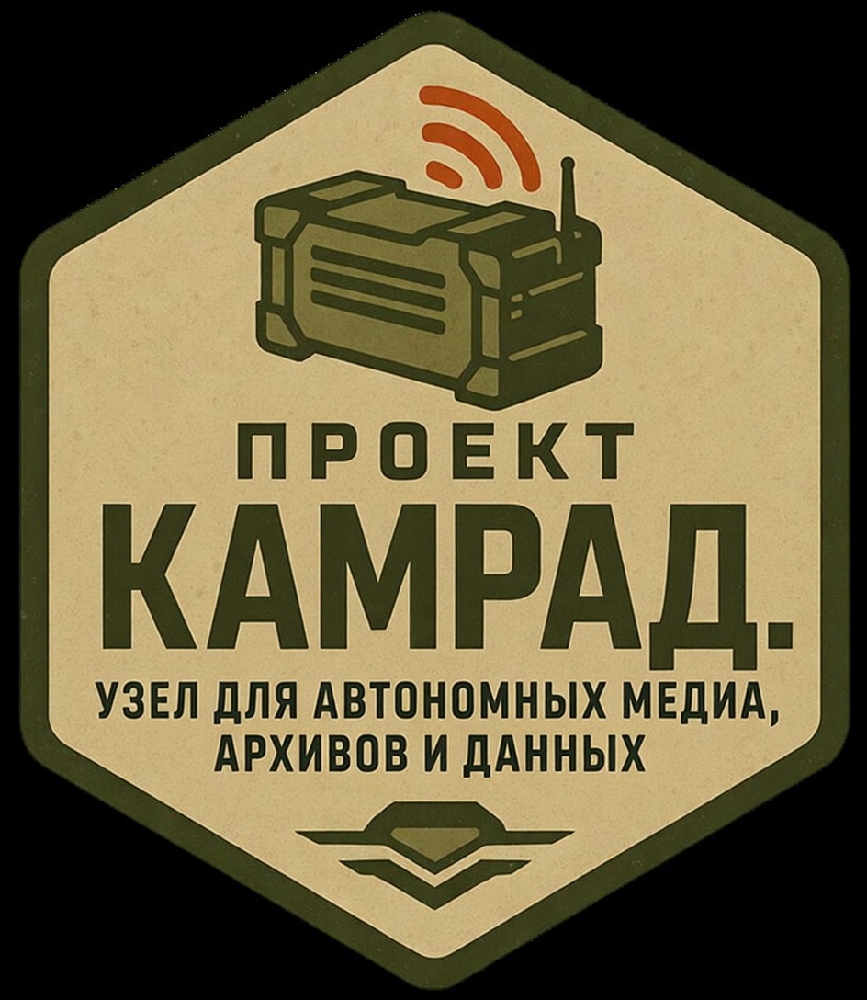

<div align="center">


# Проект КАМРАД.
### Узел для Автономных Медиа, Архивов и Данных

**Знания, которые не уходят в оффлайн**

[](https://github.com/Yumash/kamrad)
[](LICENSE)

🌐 [English](README.en.md) | **Русский** | [Deutsch](README.de.md) | [Қазақша](README.kz.md)

</div>

---

Проект КАМРАД — автономный, оффлайн-ориентированный сервер знаний и образования со встроенным AI-чатом, библиотеками, картами и инструментами — всё в одном месте, без интернета.

## Возможности

| Возможность | На базе | Что даёт |
|-------------|---------|----------|
| Библиотека знаний | Kiwix | Оффлайн Википедия, медицинские справочники, руководства, книги |
| AI-ассистент | Ollama + Qdrant | Локальный чат с загрузкой документов и семантическим поиском |
| Образование | Kolibri | Курсы Khan Academy, отслеживание прогресса |
| Оффлайн-карты | ProtoMaps | Загружаемые карты регионов с поиском и навигацией |
| Инструменты данных | CyberChef | Шифрование, кодирование, хеширование и анализ данных |
| Заметки | FlatNotes | Локальные заметки с поддержкой Markdown |
| Бенчмарк | Встроенный | Оценка производительности оборудования |

## Быстрая установка

*Требуется: Debian-based ОС (рекомендуется Ubuntu). Необходимы права sudo/root.*

```bash
sudo apt-get update && sudo apt-get install -y curl && curl -fsSL https://raw.githubusercontent.com/Yumash/kamrad/refs/heads/main/install/install_kamrad.sh -o install_kamrad.sh && sudo bash install_kamrad.sh
```

После установки откройте браузер: `http://localhost:8080` (или `http://IP_УСТРОЙСТВА:8080`)

## Требования к оборудованию

#### Минимальные
- Процессор: 2 ГГц, двухъядерный
- RAM: 4 ГБ
- Хранилище: 5 ГБ свободного места
- ОС: Debian-based (Ubuntu рекомендуется)

#### Оптимальные (для AI)
- Процессор: AMD Ryzen 7 / Intel Core i7
- RAM: 32 ГБ
- GPU: NVIDIA RTX 3060 или аналог (больше VRAM = крупнее модели)
- Хранилище: 250 ГБ SSD

## Мультиязычность

КАМРАД поддерживает несколько языков интерфейса и контента:
- 🇷🇺 Русский (основной)
- 🇬🇧 English
- 🇩🇪 Deutsch
- 🇰🇿 Қазақша

Контент-коллекции (Википедия, образование) доступны для каждого языка отдельно. Карты — глобальные.

## Конфиденциальность

- **Нулевая телеметрия** — никаких данных не собирается и не отправляется
- **Локально** — всё хранится на вашем устройстве
- **Без аккаунтов** — работает без регистрации
- **Интернет по желанию** — нужен только для загрузки контента

## FAQ

Ответы на частые вопросы — см. [FAQ.md](FAQ.md)

## Лицензия

Apache License 2.0 — см. [LICENSE](LICENSE)

## Attribution

> Основан на [Project N.O.M.A.D.](https://github.com/Crosstalk-Solutions/project-nomad) от Crosstalk Solutions LLC.
> Оригинальный проект лицензирован под Apache License 2.0.

## Участие в проекте

Приветствуются pull requests и issues! См. [CONTRIBUTING.md](CONTRIBUTING.md) для деталей.
